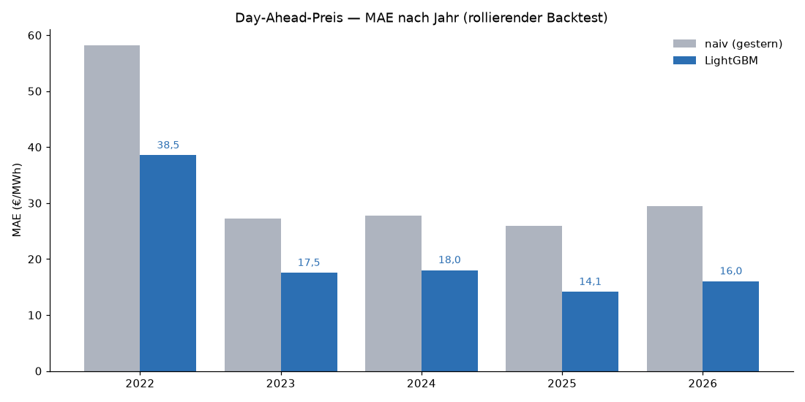

# Day-Ahead-Strompreisprognose für Deutschland (DE/LU)

Prognose des deutschen **Day-Ahead-Großhandelspreises** — alle 24 Stundenpreise eines
Tages, erstellt zum täglichen **Gate Closure** (12:00 am Vortag) aus offenen Daten. Der
Kern des Projekts ist nicht ein möglichst ausgefallenes Modell, sondern eine **ehrliche,
leckagefreie Evaluation gegen starke Baselines**: Ein Modell ist nur interessant, solange
es diese Baselines auf einem sauberen rollierenden Backtest tatsächlich schlägt.

**▶️ Live-Demo: [energy-forecast-poh.streamlit.app](https://energy-forecast-poh.streamlit.app/)**
— Prognose vs. Ist, Merit-Order-Streudiagramm und die Metriken gegen die Baselines, ohne
Setup direkt im Browser.

## Worum es geht und warum es nützt

Der Day-Ahead-Preis ist das Signal, das dem Geld am nächsten ist: Er steuert den
**Stromhandel**, den **Speicher-Dispatch** und das Fahren **flexibler Lasten**. Wer den
Preis des Folgetags besser trifft, disponiert Erzeugung und Verbrauch günstiger und
verkleinert das Risiko im kurzfristigen Handel. Besonders wertvoll sind die Extreme:
**negative Preise** (Überschuss aus Wind/PV) und **Preisspitzen** in knappen Stunden — die
Momente, in denen sich eine gute Prognose in Euro auszahlt.

**Abgrenzung zu SMARD:** SMARD veröffentlicht den *realisierten* Day-Ahead-Preis (das geräumte
Ergebnis der EPEX-Auktion) und Fundamental-Prognosen für Last, Wind und PV — aber **keine
Preisprognose**. Der realisierte Preis ist hier das Label, das das Modell zum Gate Closure
schätzt; die Fundamental-Prognosen sind seine Eingaben. Eine eigenständige Vorhersage des
Preises selbst liefert weder SMARD noch ENTSO-E — genau diese Lücke füllt das Projekt.

**Ergebnis vorweg:** Über den rollierenden Backtest (2022–2026) senkt das Modell den
mittleren absoluten Fehler der stärksten naiven Baseline (Tagespersistenz „gestern") von
**34,1 €/MWh** auf **21,4 €/MWh** — eine Reduktion um **37,4 %**, und es schlägt jede naive
Baseline in **jedem** Jahr, auch im Gaskrisenjahr 2022. Negative Preisstunden erkennt es mit
**79 % Precision bei 61 % Recall**.

## Prognose-Rahmen: Gate Closure & Leckagefreiheit

Das ist der eigentliche Punkt des Projekts. Die Day-Ahead-Auktion fixiert **alle 24
Stundenpreise eines Tages D auf einmal**, zum Gate Closure um **12:00 (Europe/Berlin) am
Vortag D-1**. Eine ehrliche Prognose darf deshalb nur Informationen nutzen, die zu diesem
Zeitpunkt bereits bekannt sind:

- **Fundamentaldaten sind SMARDs eigene Vor-Gate-Prognosen** — prognostizierte Last, Wind
  onshore/offshore, PV und die daraus resultierende **Residuallast-Prognose** (der primäre
  Preistreiber). Weil dies *Prognosen* sind — die **Day-Ahead**-Serie, am Vortag D-1
  veröffentlicht, bewusst nicht die erst am Liefertag aktualisierte Intraday-Serie —, ist ihr
  Wert **zur Lieferstunde** ex ante bekannt und damit leckagefrei nutzbar (zur verbleibenden
  Vintage-Feinheit siehe unten unter *Grenzen*). Das erspart dem
  Modell einen perfekten-Vorhersage-Wetter-Proxy — ein bekanntes Ehrlichkeitsproblem
  wetterbasierter Prognosen entfällt hier bauartbedingt.
- **Preishistorie strikt ≤ Gate Closure:** Same-Hour-Lags auf D-1/D-2/D-7 (deren Preiskurven
  in früheren Auktionen längst geräumt sind) sowie Tagesaggregate der Vortagskurve
  (Mittel/Min/Max/Std) und ein rollierender 7-Tage-Mittelwert. Diese Aggregate sind **um
  ganze Tage** verschoben, sodass Tag D vollständig ausgeschlossen bleibt.
- **Kalender der Lieferstunde** (deterministisch).

Die zu vermeidende Falle: Das generische „h-Schritt-voraus"-Template (Ursprung = τ−h) würde
späten Tagesstunden erlauben, Ist-Werte von *nach* 12:00 des Vortags zu sehen. Genau deshalb
wird der Preis **nicht** mit dem Standard-Supervised-Builder gebaut, sondern mit einem
Gate-Closure-bewussten Builder (`make_supervised_dayahead`), der per Test gegen genau dieses
Leck abgesichert ist ([`tests/test_pipeline.py`](tests/test_pipeline.py), inkl. positivem
Kontrollfall auf Tag D+1).

## Daten

Alle Quellen sind offen und **ohne API-Token** nutzbar; ein frischer Clone baut den
kompletten Datensatz mit `python -m src.data` neu auf.

| Quelle | Rolle | Details |
| --- | --- | --- |
| [SMARD.de](https://www.smard.de) (Bundesnetzagentur) | **Ziel** | Day-Ahead-Preis DE/LU, stündlich (Filter `4169`, Historie ab 2018) |
| SMARD Day-Ahead-Prognosen | Fundamentaldaten | prog. Last (`411`), Wind onshore (`123`) / offshore (`3791`), PV (`125`), Residuallast (`4362`) — Region DE |

Warum diese Wahl:

- **SMARD als Ziel**, weil es die offizielle, token-freie Quelle der Bundesnetzagentur ist
  und den geräumten Day-Ahead-Preis in konsistenter Stundenauflösung liefert.
- **Die Fundamentaldaten sind SMARDs eigene Day-Ahead-Prognosen**, keine Ist-Werte — genau
  das macht sie zum Prognosezeitpunkt verfügbar und leckagefrei. Die Residuallast-Prognose
  liefert SMARD sowohl direkt (`4362`) als auch über ihre Komponenten (`411 − 123 − 3791 −
  125`); der eingebaute Abgleich der beiden (`corr = 1,0`) ist ein Plausibilitätscheck der
  Datenpipeline.
- **Stündliche Auflösung ab 2021**: lang genug für einen aussagekräftigen rollierenden
  Backtest über mehrere Preisregime (ruhige Jahre → Gaskrise 2022 → Normalisierung).

Alles wird auf **einen** stündlichen Index in **Europe/Berlin** ausgerichtet (die
Sommer-/Winterzeit wird sauber über die Umrechnung aus UTC behandelt). Laden und
Zusammenführen liegen in [`src/data.py`](src/data.py).

## Methode

1. **EDA** ([`notebooks/03_price_eda.ipynb`](notebooks/03_price_eda.ipynb)) — Preisregime
   über die Zeit, Verteilung und Preisdauerlinie, das **Merit-Order-Streudiagramm** (Preis
   vs. Residuallast, eingefärbt nach EE-Anteil), Negativpreise nach Jahr/Stunde, die
   wandernde Duck-Curve und Autokorrelation. Jeder Schritt ist begründet dokumentiert.
2. **Baselines** — drei rein kausale Shifts, alle für den Day-Ahead-Rahmen gültig:
   Tagespersistenz (gestern, gleiche Stunde), saisonal-naiv (letzte Woche, gleiche Stunde)
   und die wochentagsabhängige **Lago-Baseline** (Lago et al. 2021; Di–Fr „gestern",
   Mo/Sa/So „letzte Woche"), der Literaturstandard der Strompreisprognose. Berichtet wird
   gegen die **empirisch stärkste** — hier die Tagespersistenz, die die Lago-Kombination in
   diesem niveau-driftenden Markt sogar schlägt (Details unter *Ergebnisse*).
3. **Gate-Closure-Features** — `make_supervised_dayahead` baut die (X, y)-Matrix indiziert
   nach Lieferstunde, mit der oben beschriebenen Semantik (Fundamental-Prognosen zu τ,
   Preishistorie um ganze Tage verschoben, Kalender von τ).
4. **Evaluation** ([`notebooks/04_price_model.ipynb`](notebooks/04_price_model.ipynb)) — ein
   **rollierender Backtest (rolling origin)**, niemals ein zufälliger Split. LightGBM wird
   monatlich auf einem rollierenden Zwei-Jahres-Fenster neu trainiert und auf dem Folgemonat
   bewertet; die Baselines werden auf **exakt denselben** Zeitstempeln gemessen. Metriken:
   MAE und RMSE in €/MWh plus MAE-Reduktion relativ zur stärksten naiven Baseline — **kein
   MAPE**, weil Preise die Null kreuzen und negativ werden.

## Ergebnisse

Rollierender Backtest über 2022–2026 (monatliches Neutraining, Zwei-Jahres-Fenster; die
Daten reichen bis 2021 zurück, das erste Trainingsfenster verbraucht das erste Jahr).
Referenz ist die **stärkste** naive Baseline — die Tagespersistenz („gestern"). Sie schlägt
nicht nur die saisonal-naive, sondern auch die wochentagsabhängige **Lago-Baseline**: In
einem so **niveau-driftenden** Markt (Gaskrise) kostet der 7-Tage-Rückgriff an Mo/Sa/So mehr,
als sein Wochentags-Vorteil einbringt. LightGBM schlägt alle drei klar und über alle Regime.

| Modell | MAE (€/MWh) | RMSE (€/MWh) | ggü. „gestern" |
| --- | ---: | ---: | ---: |
| **LightGBM** | **21,4** | **35,0** | **−37,4 %** |
| naiv („gestern") — Referenz | 34,1 | 54,0 | — |
| Lago (wochentagsabhängig) | 36,5 | 58,1 | +6,9 % |
| saisonal-naiv | 45,2 | 70,7 | +32,5 % |

(Negativ = weniger Fehler als die Referenz.)

Die ehrliche Regime-Story, die nur ein rollierender Backtest abbildet: 2022 (Gaskrise) ist
mit Abstand das schwerste Jahr, danach normalisieren sich Niveau und Fehler — aber das
Modell schlägt die Baseline in **jedem** Jahr.



- **Merit-Order bestätigt:** In der Feature-Importance dominiert die
  **Residuallast-Prognose** (~56 % Gain), gefolgt von der Preishistorie (~27 %, das
  Brennstoffkosten-/Niveau-Regime als Gas-/EUA-Proxy) — die Modellökonomie stimmt mit der
  Theorie überein.
- **Negativpreise** (≤ 0 €/MWh, 1.869 Stunden im Backtest): erkannt mit **79 % Precision**
  bei **61 % Recall** — entscheidungsrelevant für Speicher und flexible Lasten.

Die vollständigen Zahlen, die Prognose über die Dunkelflaute im Dezember 2024 (Preisspitze
936 €/MWh), die Feature-Importances und die Fehleranalyse stehen in
[`notebooks/04_price_model.ipynb`](notebooks/04_price_model.ipynb).

## App starten

Die interaktive Streamlit-App zeigt „Prognose vs. Ist", das Merit-Order-Streudiagramm und
die Metriken gegen die Baselines — das Schaustück des Projekts.

**Am einfachsten:** die gehostete Live-Demo oben anklicken (kein Setup nötig).

**Lokal:**

```bash
python3.12 -m venv .venv && source .venv/bin/activate
pip install -r requirements.txt

streamlit run app/streamlit_app.py
```

Die App liegt bereits mit den eingecheckten Backtest-Ergebnissen vor und startet ohne
weiteren Datenabruf. Um die Pipeline komplett neu aufzubauen:

```bash
python -m src.data        # SMARD-Preis + Prognosen holen -> data/processed/dataset.parquet
python -m src.evaluate    # rollierender Backtest -> Preis-Metriken + Prognosen
pytest                    # Leckage-/Backtest-Integritätstests
```

## Aufbau des Repos

```
src/            data.py · features.py · model.py · evaluate.py · config.py
notebooks/      03_price_eda.ipynb · 04_price_model.ipynb
app/            streamlit_app.py  (Prognose vs. Ist + Merit-Order + Metriken)
tests/          Gate-Closure-Leckage- und Backtest-Integritätstests
data/           raw/ + processed/ (git-ignoriert; von src.data neu aufgebaut)
```

## Grenzen und nächste Schritte

- **Prognose-Vintage nicht aus dem Archiv rekonstruierbar.** Als Fundamentaldaten dienen SMARDs
  **Day-Ahead**-Prognosen — bewusst nicht die Intraday-Prognosen, die erst am Liefertag (~08:00)
  aktualisiert werden und deren Nutzung Leckage wäre. Die Day-Ahead-Werte werden am Vortag von
  den ÜNB jedoch bis ~18:00 fortgeschrieben, also über das 12:00-Gate-Closure hinaus, während
  SMARDs Archiv je Zeitstempel nur die konsolidierte Endfassung liefert (keine Vintage-Snapshots).
  Die exakt um 12:00 verfügbare Version ist daraus nicht rekonstruierbar — ein potenziell mildes
  optimistisches Bias, das hier offen benannt statt versteckt wird. Es dürfte gering sein
  (Day-Ahead-Revisionen im Tagesverlauf sind klein), und die Vor-12:00-Version ist ohnehin genau
  der Informationsstand, den die Auktion selbst einpreiste.
- **Kein expliziter Gas- (TTF) / CO2-Preis (EUA).** Diese setzen den Brennstoff-Floor der
  Merit Order und trieben den Niveausprung 2022. Das Modell stützt sich auf **Preis-Lags als
  Proxy** für das Brennstoffkosten-Regime (der geräumte Vortagespreis kodiert die heutigen
  Brennstoffkosten). Eine freie, lizenzsaubere Historie für TTF/EUA gibt es nicht token-frei
  — daher eine bewusste, offen benannte Auslassung.
- **Eine Gebotszone (DE/LU), nur bundesweite Feiertage.** Der Nord-Süd-Engpass bildet sich im
  einheitlichen DE/LU-Preis strukturell nicht ab; bundeslandspezifische Feiertage bleiben
  außen vor.
- **Punktprognosen.** Noch keine Prognoseintervalle — quantile/probabilistische Vorhersagen
  sind der natürliche nächste Schritt.
- **Spitzen und Knappheitsstunden** bleiben die schwersten Fälle und werden in der
  Fehleranalyse offen berichtet, nicht weggeglättet.

---
*Teil des [DS-Portfolios](../README.md).*
