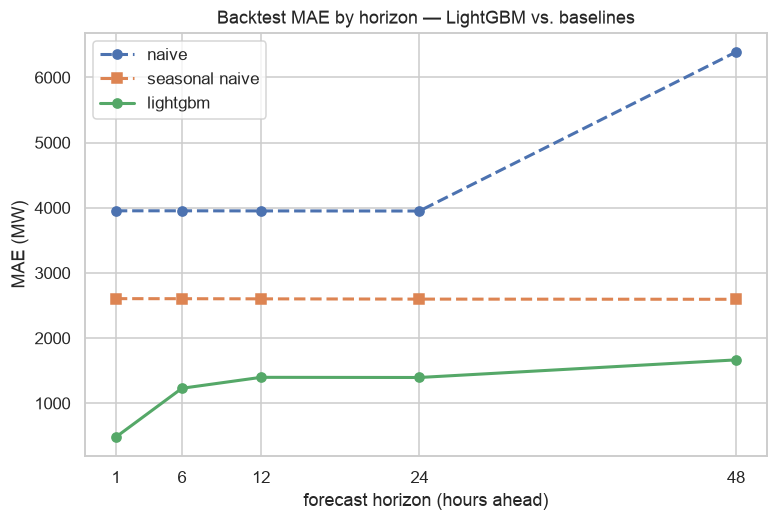

# Kurzfrist-Lastprognose für das deutsche Stromnetz

Prognose der deutschen Netzlast (Stromverbrauch) **1–48 Stunden im Voraus** aus offenen
Daten. Der Kern des Projekts ist nicht ein möglichst ausgefallenes Modell, sondern eine
**ehrliche, leckagefreie Evaluation gegen starke Baselines**: Ein Modell ist nur
interessant, solange es diese Baselines auf einem sauberen Backtest tatsächlich schlägt.

**▶️ Live-Demo: [energy-forecast-poh.streamlit.app](https://energy-forecast-poh.streamlit.app/)**
— Prognose vs. Ist und die Metriken gegen die Baselines, ohne Setup direkt im Browser.

## Worum es geht und warum es nützt

Netzbetreiber und Händler brauchen belastbare Kurzfristprognosen der Last — sie sind die
Grundlage für **Fahrplanmanagement und Netzbilanz**, die Vorhaltung von **Regelleistung
(Reserve)**, **Redispatch** und den **Day-Ahead-/Intraday-Handel**. Jede Megawattstunde
Prognosefehler muss später teuer über Reserve- und Ausgleichsenergie aufgefangen werden.
Eine bessere Prognose bedeutet also unmittelbar weniger vorzuhaltende Reserve und
geringere Ausgleichskosten.

Das Projekt prognostiziert die stündliche deutsche Netzlast bis zu 48 Stunden voraus und
zeigt **pro Horizont**, wie viel ein gelerntes Modell gegenüber naiven, saisonalen
Baselines wirklich gewinnt.

**Ergebnis vorweg:** Auf 24 Stunden senkt das Modell den mittleren absoluten Fehler von
rund **2.600 MW** (saisonal-naiv) auf etwa **1.400 MW** — im Schnitt **~1.200 MW weniger
Fehler**, die Größenordnung eines großen Kraftwerksblocks, den man nicht als Reserve
vorhalten muss. Das entspricht **2,7 % MAPE** auf 24 Stunden.

## Daten — Auswahl und Begründung

Alle Quellen sind offen und **ohne API-Token** nutzbar; ein frischer Clone baut den
kompletten Datensatz mit `python -m src.data` neu auf.

| Quelle | Rolle | Details |
| --- | --- | --- |
| [SMARD.de](https://www.smard.de) (Bundesnetzagentur) | **Ziel** | Netzlast, stündlich, `chart_data`-API (Filter 410, Region DE) |
| [Open-Meteo](https://open-meteo.com) | Merkmal | 2 m-Temperatur, bevölkerungsgewichtet über die sechs größten Städte |
| [Energy-Charts](https://api.energy-charts.info) (Fraunhofer ISE) | Merkmal | Day-Ahead-Preis (DE-LU) und Erzeugungsmix |

Warum diese Wahl:

- **SMARD als Ziel**, weil es die offizielle, token-freie Quelle der Bundesnetzagentur
  ist und die realisierte Netzlast in konsistenter Stundenauflösung liefert.
- **Temperatur als wichtigster exogener Treiber** — Heizen und Kühlen bestimmen den
  kurzfristigen Verbrauch stark. Statt eines einzelnen Messpunkts wird ein
  **bevölkerungsgewichteter Mittelwert** über die sechs größten Städte gebildet, der die
  nachfragerelevante Temperatur des Landes besser abbildet.
- **Preis und Erzeugungsmix** ergänzen das Bild um Markt- und Einspeisesignale; sie
  gehen bewusst nur **verzögert (als Lags)** ein, weil ihr aktueller Wert zum
  Prognosezeitpunkt noch nicht bekannt ist.
- **Stündliche Auflösung ab 2021**: fein genug für die Tages- und Wochenstruktur der
  Last und mit ~4,5 Jahren Historie lang genug für einen aussagekräftigen
  rollierenden Backtest.

Alles wird auf **einen** stündlichen Index in **Europe/Berlin** ausgerichtet (die
Sommer-/Winterzeit wird sauber über die Umrechnung aus UTC behandelt). Laden und
Zusammenführen liegen in [`src/data.py`](src/data.py).

## Methode

1. **EDA** ([`notebooks/01_eda.ipynb`](notebooks/01_eda.ipynb)) — Tages-, Wochen- und
   Jahressaisonalität, der Feiertagseffekt, Datenqualität, Autokorrelation und der
   Zusammenhang von Last und Temperatur. Jeder Schritt ist begründet dokumentiert.
2. **Baselines** — Tagespersistenz (gleiche Stunde, ganzer Vortag) und **saisonal-naiv**
   (gleiche Stunde, Vorwoche). Wegen der starken Wochenstruktur der Last ist saisonal-naiv
   eine ernstzunehmende Messlatte, nicht bloß ein Strohmann.
3. **Modell** — LightGBM auf Lag-, Kalender-, Wetter- und (verzögerten) Preis-/Mix-
   Merkmalen. Aufbau als **direkte Multi-Horizont-Prognose**: ein Modell je Horizont,
   das `y(t+h)` aus den zum Zeitpunkt `t` verfügbaren Informationen schätzt.
4. **Evaluation** ([`notebooks/02_modeling.ipynb`](notebooks/02_modeling.ipynb)) — ein
   **rollierender Backtest (rolling origin)**, niemals ein zufälliger Split. LightGBM wird
   monatlich auf einem rollierenden Zwei-Jahres-Fenster neu trainiert und auf dem
   Folgemonat bewertet; die Baselines werden auf **exakt denselben** Zeitstempeln
   gemessen. Metriken: MAE, MAPE, RMSE je Horizont, immer relativ zu den Baselines.

**Leckagefreiheit** ist der eigentliche Punkt des Projekts und wird in Code und Tests
erzwungen:

- Jedes Merkmal zur Zielzeit `τ = t+h` nutzt ausschließlich Daten, die zum Ursprung `t`
  verfügbar sind.
- Lags und rollierende Statistiken sind so verschoben, dass der aktuelle Wert nie in sein
  eigenes Fenster einfließt.
- Wetter geht als Temperatur zur Zielstunde ein — ein **perfekter-Vorhersage-Proxy**, der
  unten offen als Grenze benannt wird; Preis und Erzeugungsmix gehen nur als zum
  Zeitpunkt `t` bekannte Lags ein.
- [`tests/test_pipeline.py`](tests/test_pipeline.py) prüft die Lag-Verschiebungen und die
  Überschneidungsfreiheit der Backtest-Folds.

## Ergebnisse

Rollierender Backtest über 2022–2026 (monatliches Neutraining, Zwei-Jahres-Fenster; die
Daten reichen bis 2021 zurück, das erste Trainingsfenster verbraucht das erste Jahr).
LightGBM schlägt die starke saisonal-naive Baseline auf **jedem** Horizont — um **82 %
auf 1 h** und immer noch **36 % auf 48 h**. Auf 24 Stunden prognostiziert es die
stündliche deutsche Last auf **2,7 % MAPE (≈ 1.400 MW)**.

| Horizont | LightGBM MAE | LightGBM MAPE | Saisonal-naiv MAE | MAE-Reduktion |
| ---: | ---: | ---: | ---: | ---: |
| 1 h  | 482 MW   | 0,92 % | 2.605 MW | **−81,5 %** |
| 6 h  | 1.229 MW | 2,34 % | 2.604 MW | −52,8 % |
| 12 h | 1.398 MW | 2,66 % | 2.602 MW | −46,3 % |
| 24 h | 1.395 MW | 2,67 % | 2.598 MW | −46,3 % |
| 48 h | 1.665 MW | 3,17 % | 2.595 MW | −35,8 % |



Die Tagespersistenz-Baseline ist noch schwächer (7–12 % MAPE) und ist der Übersicht
halber aus der Tabelle ausgelassen; sie erscheint in der Abbildung und in der App. Die
vollständigen Zahlen je Horizont, die Fehleranalyse und die Feature-Importances stehen in
[`notebooks/02_modeling.ipynb`](notebooks/02_modeling.ipynb).

## App starten

Die interaktive Streamlit-App zeigt „Prognose vs. Ist" und die Metriken gegen die
Baselines — das Schaustück des Projekts.

**Am einfachsten:** die gehostete Live-Demo oben anklicken (kein Setup nötig).

**Lokal:**

```bash
python3.12 -m venv .venv && source .venv/bin/activate
pip install -r requirements.txt

streamlit run app/streamlit_app.py
```

Die App liegt bereits mit den eingecheckten Backtest-Ergebnissen vor und startet ohne
weiteren Datenabruf. Um die Pipeline komplett neu aufzubauen:

```bash
python -m src.data        # Daten holen + data/processed/dataset.parquet zusammenführen
python -m src.evaluate    # rollierender Backtest -> Metriken + Prognosen
pytest                    # Leckage-/Backtest-Integritätstests
```

## Aufbau des Repos

```
src/            data.py · features.py · model.py · evaluate.py · config.py
notebooks/      01_eda.ipynb · 02_modeling.ipynb
app/            streamlit_app.py  (Prognose vs. Ist + Metriken)
tests/          Leckage- und Backtest-Integritätstests
data/           raw/ + processed/ (git-ignoriert; von src.data neu aufgebaut)
```

## Grenzen und nächste Schritte

- **Wetter ist ein perfekter-Vorhersage-Proxy.** Auf der beobachteten Temperatur zu
  trainieren ist optimistisch; ein Produktivsystem würde eine numerische Wettervorhersage
  einspeisen, deren Fehler die Lastprognose vor allem auf langen Horizonten aufweiten
  würde. Das ist die ehrlichste Einschränkung der Ergebnisse.
- **Eine Preiszone / nationale Feiertage.** Der Preis nutzt die Day-Ahead-Zone DE-LU, der
  Kalender nur bundesweite Feiertage — bundeslandspezifische Tage bleiben außen vor.
- **Punktprognosen.** Noch keine Prognoseintervalle — quantile/probabilistische
  Vorhersagen sind der natürliche nächste Schritt.
- **Wenig Tuning.** LightGBM läuft auf vernünftigen Standardwerten; der Fokus liegt auf
  der Evaluation, nicht auf den letzten Prozentpunkten.

---
*Teil des [DS-Portfolios](../README.md).*
